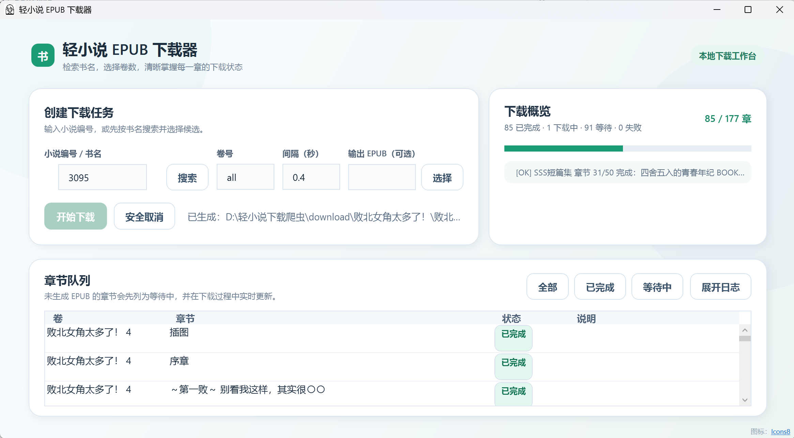

# linovelib 小说下载 → EPUB

将可访问的小说页面内容、封面和插图整理为 EPUB。可按小说编号或书名定位，并选择一个或多个卷。

> 仅供个人学习与已获授权的内容处理使用，请尊重作者、译者和发布平台的版权与使用规则。

## 环境

- Python 3.10+
- 依赖见 `requirements.txt`

```bash
python -m pip install -r requirements.txt
```

## 操作设置（Windows）

### 第一次使用

1. 打开 PowerShell 或命令提示符，进入项目目录：

   ```powershell
   cd "轻小说下载爬虫"
   ```

2. 安装依赖（只需首次执行，或依赖更新后重新执行）：

   ```powershell
   python -m pip install -r requirements.txt
   ```

3. 选择一种启动方式：

   - **交互式（推荐）**：双击 `download.bat`，或在终端执行 `python launcher.py`。
   - **Windows WPF 图形界面**：双击 `轻小说下载器.exe`。它会构建并启动当前项目的 WPF 源码；界面会显示实际待下载章节、进度和安全取消状态。
   - **命令行**：在终端直接执行 `python main.py` 并附加参数，适合固定配置或批量运行。

### 交互式设置

启动 `launcher.py` 后，按提示依次填写：

1. **小说编号或书名**：取小说页面地址中的编号更稳。例如页面地址是
   `https://www.linovelib.com/novel/3095/181030.html`，应输入 `3095`；也可以直接输入书名（如 `败北女角太多了`），会自动搜索解析编号。
2. **卷数**：输入目录显示的卷序号，例如 `4`；多个卷用英文逗号分隔，例如 `1,3,5`；输入 `all` 下载全部卷。
3. 每个章节完成时会显示进度；本次任务结束后会回到编号/书名输入处，可继续下载另一部小说。输入 `q` 或直接回车退出。

默认生成的 EPUB 位于项目根目录下的 `download/<小说名>/`。若某个目标 EPUB 已存在会自动跳过（重新下载请加 `--force`；`--out` 与 `--merge` 同样适用）。缓存位于 `_tmp_dl/`，两者都不上传到 GitHub。

### Windows WPF 图形界面

双击项目根目录的 `轻小说下载器.exe` 启动桌面界面。它会使用本机 .NET SDK 构建项目中的 WPF 源码后独立打开窗口；若窗口已经打开，则会直接激活现有窗口而不会重复构建。该 EXE 不包含下载器代码或数据，下载、缓存和配置均继续使用当前项目目录。

点击右上角“打开下载目录”，可在资源管理器中查看当前项目 `download/` 下按书名存放的小说。目录不存在时会自动创建；自定义“输出 EPUB”的文件仍保存在自行选择的位置。界面背景为本地内嵌插画，离线可用；来源与授权见 [背景图片说明](wpf/LinovelibDesktop/Assets/BACKGROUND-LICENSE.md)。

界面默认下载全部卷；可把“卷号”改为 `1-3,5` 等范围。开始后，表格会列出未生成 EPUB 的剩余章节，并实时标为“等待中 / 下载中 / 已完成 / 失败”。点击“安全取消”会在准备阶段或当前章节边界停止，不会强制终止 Python。

#### 项目展示



### 常用设置速查

| 目标 | 示例 | 作用 |
|---|---|---|
| 下载一卷 | `python main.py --novel 3095 --volumes 4` | 下载目录中第 4 个卷选项 |
| 下载多卷 | `python main.py --novel 3095 --volumes 1,3,5` | 仅下载指定卷，逗号之间不加空格 |
| 下载全部 | `python main.py --novel 3095 --vol all` | 下载全部目录卷 |
| 自定义文件位置 | `python main.py --novel 3095 --volumes 4 --out output/book.epub` | 输出到相对项目目录的 `output/` 下 |
| 降低请求频率 | `python main.py --novel 3095 --volumes 4 --delay 2` | 每次请求至少间隔 2 秒，网络受限时建议使用 |
| 不弹出卷选择 | `python main.py --novel 3095 --vol all --no-interactive` | 适合脚本自动执行 |
| 重新下载已存在 | `python main.py --novel 3095 --volumes 4 --force` | 目标已存在时仍覆盖重下（默认自动跳过） |

## 用法

```bash
# 直接按编号处理第 1 卷；--out 可指定相对路径或绝对路径
python main.py --novel 3095 --volumes 1 --out output/book.epub

# 下载全部卷
python main.py --novel 3095 --vol all

# 按书名搜索（用真实浏览器渲染本站搜索 /S6/?searchkey= 解析编号；无浏览器时回退 Bing / DuckDuckGo 的 site: 搜索）
python main.py --name "败北女角太多了"

# --novel 也接受书名：非纯数字时自动按书名搜索
python main.py --novel "败北女角太多了"

# 不指定 --vol / --volumes 时会进入交互式卷多选
python main.py --novel 3095
```

## 参数

| 参数 | 说明 |
|---|---|
| `--novel` | 小说编号，如 `3095`（来自小说页 URL `/novel/3095.html`） |
| `--name` | 小说书名（用真实浏览器渲染本站搜索解析编号；无浏览器时回退 Bing / DuckDuckGo 的 `site:` 搜索） |
| `--volumes` | 选择卷（从 1 开始，逗号分隔，如 `1,3,5`） |
| `--vol all` | 下载全部卷 |
| `--out` | 输出 `.epub` 路径；未传入时写入项目根目录的 `download/<书名>/` |
| `--force` | 目标 EPUB 已存在时仍重新下载并覆盖（默认检测到已存在则跳过） |
| `--delay` | 请求间隔秒，默认 `0.4`，慢速限流设置 |
| `--no-interactive` | 未指定 `--vol/--volumes` 时不弹交互、下载全部 |

## 目录与相对路径

项目不包含机器专属的绝对路径。可整体复制、移动或 `git clone` 到任意目录后运行：

```text
轻小说下载爬虫/
├─ linovelib/             # 解析、下载与 EPUB 构建模块
├─ tests/                 # 离线单元测试与页面夹具
├─ docs/                  # 发布设计与实施记录
├─ main.py                # 命令行入口
├─ launcher.py            # Windows 交互式入口
├─ 轻小说下载器.exe          # Windows WPF 源码界面启动器
├─ download.bat           # Windows 批处理启动器
├─ wpf/                   # WPF 桌面界面项目
├─ requirements.txt       # Python 依赖
└─ README.md
```

运行产生的项目自有目录始终相对项目根目录：

- `_tmp_dl/`：页面和图片缓存；
- `download/`：未传 `--out` 时的默认 EPUB 输出目录。

二者均被 Git 忽略，不会上传。`--out` 是用户明确指定的输出位置，按其传入的相对路径或绝对路径处理。

## 输出

- 生成的 `.epub` 包含封面、书名页、目录，以及所选卷的章节正文与插图，并按轻小说规范排版：中文（`zh-CN`）、正文首行缩进两字、两端对齐、舒适行距、章节标题分页居中、封面/插图居中等比缩放。
- 下载的原始图片缓存于 `_tmp_dl/images/`（可手动删除）。
- 下载失败的章节会在结束时列出；受访问权限、频率限制或页面保护影响时，内容可能不完整。

## 说明

- 按书名搜索时用真实浏览器（`RenderFetcher`，系统 Edge，headless）渲染本站搜索 `/S6/?searchkey=书名` 解析编号——这是最可靠的来源（本站自搜、结果准确）。站点搜索只对真实浏览器返回结果，脚本化 `requests` 会拿到空页；而站外引擎 Bing / DuckDuckGo 的 `site:linovelib.com` 经常限流、索引缺失或静默放宽 `site:` 操作符，仅作无浏览器环境的兜底。搜出多个候选时（可通过 TTY）会把书名和编号列出来让你选。若浏览器不可用，稳定做法是直接给出 `--novel 编号`。
- 章节存在分页（`第X页`），已自动合并为单个 EPUB 章节。
- 请遵守目标网站的使用规则与版权要求，并设置合理请求间隔。
- 网站页面或保护策略变化时，生成结果应先自行核验；本项目不保证第三方网站内容的完整性或顺序正确性。

## 开发与验证

```bash
python -m pytest -q
```

测试使用本地夹具，不会下载小说内容。
